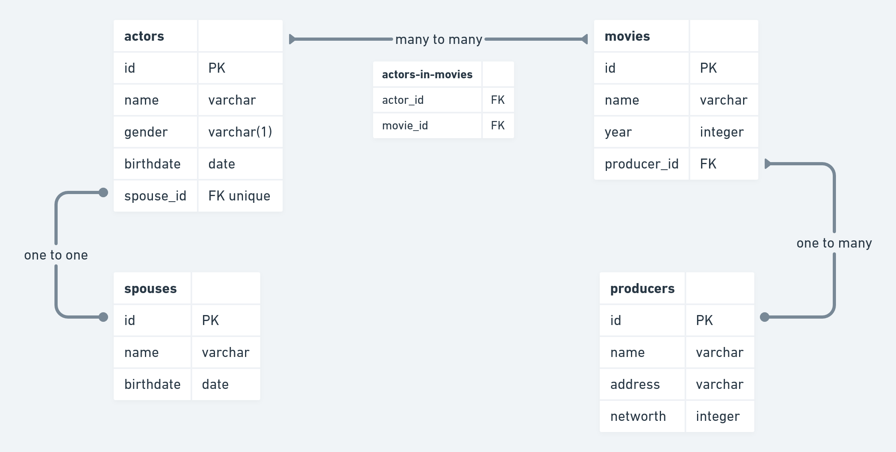

# *db_webapp*
*CRUD web application with relational database*

## [the task](https://docs.google.com/document/d/1RwLIjDxtLztUuqs1XqzqZ5scpyIcyMoG86g41yRRZng/edit)

## Used technologies
* [Django](https://www.djangoproject.com/) - *The web framework for perfectionists with deadlines.*

## Database schema

